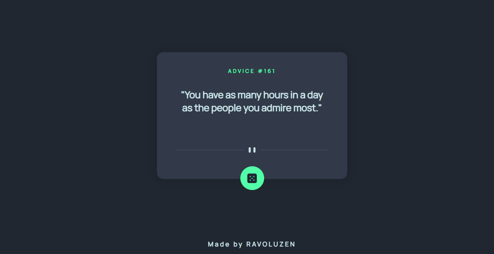

# Frontend Mentor - Advice generator app solution

This is a solution to the [Advice generator app challenge on Frontend Mentor](https://www.frontendmentor.io/challenges/advice-generator-app-QdUG-13db).

## Table of contents

- [Overview](#overview)
  - [Screenshot](#screenshot)
  - [Links](#links)
- [Built with](#built-with)
- [Author](#author)

## Overview
A web app that displays pieces of advice using the Advice Slip API: [https://api.adviceslip.com/]
### Screenshot

### Links

- [Solution URL](https://www.frontendmentor.io/solutions/advice-generator-app-fL9WhOolV)
- [Live Site URL](https://ravoluzen.github.io/advice-generator-app/)

### Built with

- HTML5
- CSS3
- Flexbox
- Vanilla JavaScript

## Author

- Frontend Mentor - [@ravoluzen](https://www.frontendmentor.io/profile/ravoluzen)
- Twitter - [@ravoluzen](https://www.twitter.com/ravoluzen)
